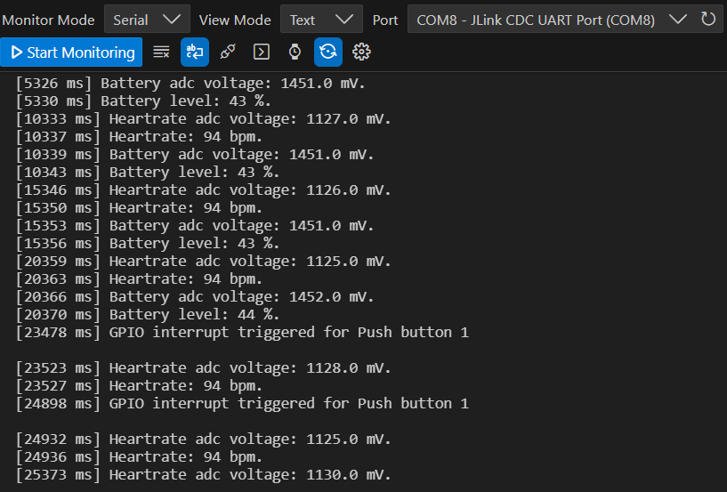
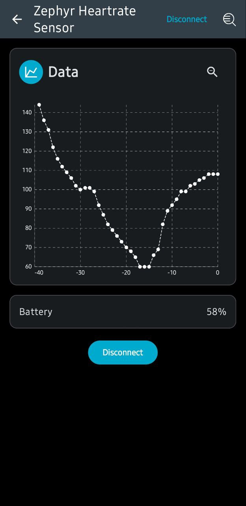

# NORAB106 Bluetooth Heart Rate

# 📟 EmbeddedProject
Embedded Application to demonstrate Bluetooth Heart Rate and battery simulation with uBlox chip NORAB106 and monitor data using Nordic Android Application.

## 🚀 Features
- ✅ Heart Rate and Battery are simulated with two potentiometers.
- ✅ Heart Rate and Battery data is sent via Bluetooth each 5 seconds.
- ✅ Heart Rate data can be sent by event pushing button 1.
- ✅ Battery data can be sent by event pushing button 2.

## 🚀 Code Features
- ✅ Abstration layer to manage gpios
- ✅ Abstraction layer to manage bluetooth protocol
- ✅ Abstraction layer to manage adc
- ✅ Functions managed with threads for bluetooth and peripheral handling

## 🔧 Requirements
- Microcontroller: UBLOX NORAB106
- Toolchain: VsCode + Extensions nRF Connect
- Hardware:
  - Potentiometers x2
  - Main Board EVK-NORAB106
- Programming Interface: USB-UART

## 🛠️ Technologies
- Languages: C
- Framework: ncs 2.2.0
- Libraries: Zephyr

## 🏗️ Hardware Setup
Heart rate and battery are simulated using potentiometers (by adc peripheral) connected to the following pins: 
| Pin Board | Component |
|:-----------:|:------------:|
| P0.04      | HR Potentiometer |
| P0.05      | Battery Potentiometer |

## 🏗️ Software Toolchian Setup
- Install VS-Code
- Install Extensions: nRF Connect for VS Code and nRF Connect for VS Code Extension Pack
- From nRF Connect, install SDK toolchain v3.0.2 (next version shouldn't be a problem)
- From nRF Connect, install n.c.s 2.2.0 (it's a big constraint to use EVK-NORAB106).

## 🏗️ Software Application Setup
- Clone github project (see suggestion below) then, there're some preliminary actions to recognize the board.
- Download the entire package https://github.com/u-blox/u-blox-sho-OpenCPU/tree/master 
- From downloaded package.
   1. navigate to the folder "zephyr/boards/arm/archive/ubx_evknorab10_nrf5340_ncs220"
   2. copy the folder and past in your ncs path  "C:\ncs\v2.2.0\zephyr\boards\arm\"
   3. At this point, you 'll able to create new project using EVK board NORAB106
- import the project in VS-Code.
- Select nRF Connect Extension in the activity bar and in this section you can build the project and flash software in your evk board.

## 📦 Github Setup
Clone the repository:
```bash
git clone https://github.com/MpDev89/NORAB106_BT_HeartRate.git
cd project-name
```

## 🗒️ Results
Data is monitored using Serial Monitor feature where battery and heart data is sent every 5s meanwhile using buttons data can be sent immediatally:


Nordic make available on the store an Android Application called nRF Toolbox for Bluetooth LE to monitor data transmitted via Bluetooth.
Follow the procedure:
- Download Android Application and open
- Tap on "Heart Rate" Service profile
- Discover device "Zephyr Heartrate Sensor" and tap on it
- Waiting the pairing procedure 
- Data start to be shown



## 🗒️ Licensing
This project includes code licensed under the Apache License 2.0.
See the LICENSE file for details.

## 🌐 Contatti
[](mailto:mp@tech-in-mind.it)  
[](https://www.linkedin.com/in/marconatale-parise-48a07b94)  
[](https://github.com/MpDev89)